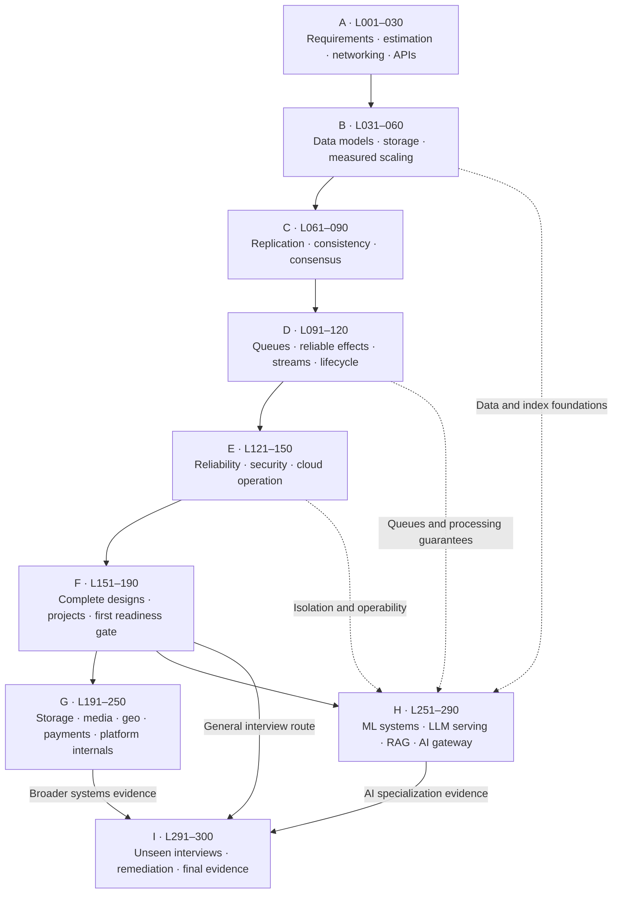

# System Design: From First Principles to Interview Readiness
## Complete course blueprint · 29 September 2026

This is the curriculum architecture, not a completed 300-lesson textbook. It follows the uploaded brief’s instruction to design the course before beginning individual lessons. The planned lesson packages, project scaffolds, solutions, and tests are specified here; they are not represented as already implemented or executed.

**300 sessions · 30 modules · 63 assessments · six projects in 24 milestones · 43 two-part case studies.** All scheduled sessions are 45–60 minutes. Their planned total is **282 hours 35 minutes**, including embedded exercises, project milestones, and assessments. The first general-interview readiness checkpoint is **L190**, at **178 hours 50 minutes**. Readiness is assessed, not awarded for finishing pages.

The primary audience is a CS master’s student with Python/SQL and backend experience who is newer to systematic system design. Your existing Docker → Kubernetes → Helm/Kyma and TypeScript/MCP work remains in place: this course supplies architecture reasoning, rather than restarting those courses. Python is the default executable language; SQL and small TypeScript examples are used where they improve understanding.

## How to read the roadmap

Priority and difficulty are separate. **🟢 Essential** is general-backend interview priority; **🟡 Important** includes breadth and role-specific material; **🔴 Advanced extension** is optional for the general route. **B** means beginner, **I** intermediate, and **A** advanced difficulty. An essential lesson can still be difficult. For AI/platform roles, the yellow AI modules become role priorities. These labels are curriculum judgments, not measured interview-frequency statistics.

**[A]** = concept-check interview; **[B]** = debug-the-architecture interview; **[C]** = partial design; **[D]** = full mock interview. **[P2.3]** means Project 2, milestone 3. Untagged rows are teaching, worked-design, lab, or review sessions as stated in their titles.

**Prerequisites:** each module lists its entry dependencies. Within a module, follow the listed order; each lesson assumes the earlier non-red lessons in that module. Red extensions do not silently become prerequisites for general-track lessons or mocks. L227 and L247 additionally require the CRDT extension L079. L297–298 additionally require the chosen advanced or AI branch. The downloadable JSON records this prerequisite rule for each lesson.

A module begins only after the required prior skills are demonstrated. Prior knowledge may be validated with its checkpoint and exercise; it is not assumed from having used a technology at work. Full numerical order is valid. Your recommended personalized order is **M01–M19 → M26–M29 → M20–M25 → M30**. M30 can also be used for general-route assessment before completing the specialist branches.

## Phase map and cumulative time

Times are planning estimates for focused work with prepared examples, not measured completion times. Independent implementation from a blank repository, environment repair, external reading, and repeat attempts add time. A practical full-route planning envelope is roughly **325–370 hours** after allowing a 15–30% reserve; this is not a promise about individual learning speed.

| Phase | Modules | Lessons | Planned hours | Cumulative hours |
|---|---|---|---:|---:|
| A — Design thinking, networking, and backend foundations | 01–03 | 001–030 | 27.9 | 27.9 |
| B — Data, storage, and measured scaling | 04–06 | 031–060 | 28.2 | 56.1 |
| C — Distributed-system foundations | 07–09 | 061–090 | 28.2 | 84.2 |
| D — Asynchronous systems and data lifecycle | 10–12 | 091–120 | 28.2 | 112.5 |
| E — Reliable, secure, cloud-native operation | 13–15 | 121–150 | 28.4 | 140.9 |
| F — Complete designs and general interview readiness | 16–19 | 151–190 | 37.9 | 178.8 |
| G — Broad and advanced system-design case library | 20–25 | 191–250 | 56.2 | 235.0 |
| H — AI/ML infrastructure specialization | 26–29 | 251–290 | 37.7 | 272.7 |
| I — Unseen capstones and evidence-based readiness | 30–30 | 291–300 | 9.9 | 282.6 |

## Dependency map

The diagram is an editable Mermaid source. Solid arrows show the main learning route; dotted arrows make key dependencies of the AI branch explicit. Module-level prerequisites below are the more detailed source of truth.

## Why this sequence

The course starts with requirements, invariants, workload estimates, and simple architectures, then adds mechanisms only when a demonstrated constraint needs them. Interview preparation is built into the learning route rather than postponed to its end. Amazon’s official SDE II preparation material emphasizes practicality, accuracy, efficiency, reliability, optimization, scalability, and a two-way design discussion [R1].

Single-database correctness precedes distributed consistency; consistency precedes coordination; durable side effects precede advanced streaming guarantees. PostgreSQL’s documentation distinguishes isolation phenomena and implementation behavior [R3]. MIT’s distributed-systems curriculum gives substantial separate attention to replication, Raft, consistency, and distributed transactions [R2]. These sources inform coverage; this syllabus and its pacing are original.

Security and observability appear early in small examples and receive dedicated production modules before the case library. OAuth teaching is anchored in current security guidance [R7]; the MCP bridge uses the authorization specification rather than assuming that attaching any JWT is sufficient [R8].

Database and broker guarantees are tested at the boundary where an application depends on them. In particular, Kafka’s documentation distinguishes transactions within Kafka from exactly-once outcomes in external systems, which require cooperation from those systems [R4].

AI is taught as workload and infrastructure design, not merely as a vector database attached to an API. Serving metrics distinguish queuing, prefill, decode, first-token latency, and output-token timing [R11]. Parallelism and prefix caching receive their own lessons [R9, R10].

## Complete lesson catalog

### M01 — Reasoning, requirements, and estimation

**Phase A · prerequisites:** Normal CS/programming fundamentals; no system-design prerequisite. **Exit skill:** Turn an ambiguous request into scoped requirements, invariants, a workload model, and a timed design plan.

| Lesson | Title and activity | Priority / depth | Minutes |
|---|---|---|---:|
| 001 | What system design is; diagnostic and your design notebook | 🟢 B | 45 |
| 002 | Requirements, non-goals, invariants, and acceptable compromises | 🟢 B | 55 |
| 003 | Latency, throughput, availability, durability, and service objectives | 🟢 B | 55 |
| 004 | Estimation I: users, actions, average traffic, and peak traffic | 🟢 B | 55 |
| 005 | [A] Clarify a vague product request and defend its estimates | 🟢 B | 60 |
| 006 | Estimation II: bytes, retention, storage, and bandwidth | 🟢 B | 55 |
| 007 | Estimation III: concurrency, Little’s law, and queueing intuition | 🟢 I | 55 |
| 008 | Estimation IV: headroom, bottlenecks, sensitivity, and cost | 🟢 I | 55 |
| 009 | The 45/60-minute interview framework; diagrams and decision records | 🟢 B | 55 |
| 010 | [C] Design a small single-server service without overengineering | 🟢 B | 60 |

### M02 — The internet and communication protocols

**Phase A · prerequisites:** M01. **Exit skill:** Trace a request, identify transport costs and trust boundaries, and select a communication protocol.

| Lesson | Title and activity | Priority / depth | Minutes |
|---|---|---|---:|
| 011 | Request journey: DNS, IP addresses, routing, and ports | 🟢 B | 55 |
| 012 | TCP versus UDP: loss, congestion, connections, and retransmission | 🟢 B | 55 |
| 013 | TLS, certificates, termination, and trust boundaries | 🟢 B | 55 |
| 014 | HTTP semantics: methods, status codes, safety, and idempotence | 🟢 B | 55 |
| 015 | [A] Trace and troubleshoot a request from browser to backend | 🟢 B | 60 |
| 016 | HTTP/1.1, HTTP/2, HTTP/3, multiplexing, and head-of-line blocking | 🟡 I | 55 |
| 017 | Forward proxies, reverse proxies, and L4/L7 load balancers | 🟢 B | 55 |
| 018 | REST versus RPC/gRPC: contracts, serialization, and coupling | 🟢 I | 55 |
| 019 | Polling, long polling, SSE, and WebSockets | 🟢 I | 55 |
| 020 | [C] Select transports for a live dashboard and chat product | 🟢 I | 60 |

### M03 — Runtime behavior and API boundaries

**Phase A · prerequisites:** M01, M02. **Exit skill:** Design usable APIs and explain concurrency, overload, request cancellation, and service boundaries.

| Lesson | Title and activity | Priority / depth | Minutes |
|---|---|---|---:|
| 021 | Processes, threads, event loops, and Python I/O workloads | 🟢 B | 55 |
| 022 | Races, bounded concurrency, cancellation, and shared state | 🟢 I | 55 |
| 023 | Resource-oriented APIs, schemas, validation, and error contracts | 🟢 B | 55 |
| 024 | Offset/cursor pagination, stable ordering, and API evolution | 🟢 I | 55 |
| 025 | [B] Repair an API with blocking calls and unstable pagination | 🟢 I | 60 |
| 026 | Authentication versus authorization; sessions and API-key basics | 🟢 B | 55 |
| 027 | Deadlines, uncertain outcomes, and safe retry boundaries | 🟢 I | 55 |
| 028 | Modular monoliths, ownership boundaries, and justified service extraction | 🟢 I | 55 |
| 029 | Lab: run the supplied service/test harness and trace concurrent requests | 🟢 I | 60 |
| 030 | [C] Design an inventory API and expose its race conditions | 🟢 I | 60 |

### M04 — Relational modeling and transactional correctness

**Phase B · prerequisites:** M03. **Exit skill:** Derive schemas and indexes from access patterns and protect business invariants under concurrent writes.

| Lesson | Title and activity | Priority / depth | Minutes |
|---|---|---|---:|
| 031 | Access patterns, entities, keys, and relational schemas | 🟢 B | 55 |
| 032 | Constraints, normalization, denormalization, and invariant ownership | 🟢 I | 55 |
| 033 | B-tree indexes, composite-key order, and covering access paths | 🟢 I | 55 |
| 034 | Query plans, selectivity, joins, and N+1 performance failures | 🟢 I | 55 |
| 035 | [A] Defend a schema and index plan for competing workloads | 🟢 I | 60 |
| 036 | Transactions and ACID: atomicity is not isolation | 🟢 I | 55 |
| 037 | Optimistic concurrency, row locks, deadlocks, and transaction retries | 🟢 I | 55 |
| 038 | MVCC and isolation histories: read committed through serializable | 🟢 I | 55 |
| 039 | [P1.1] URL shortener: persistent create/redirect path and correctness tests | 🟢 I | 60 |
| 040 | [B] Diagnose overselling and lost updates using transaction histories | 🟢 I | 60 |

### M05 — Storage engines and database selection

**Phase B · prerequisites:** M04. **Exit skill:** Choose storage properties before products, including transactional, analytical, search, graph, and blob workloads.

| Lesson | Title and activity | Priority / depth | Minutes |
|---|---|---|---:|
| 041 | Write-ahead logs, acknowledgments, crashes, and recovery | 🟢 I | 55 |
| 042 | LSM trees, SSTables, compaction, and read/write amplification | 🟡 I | 55 |
| 043 | Bloom filters, page caches, compression, and storage budgets | 🟡 I | 55 |
| 044 | Row stores, columnar analytics, and wide-column data models | 🟢 I | 55 |
| 045 | [A] Choose an engine from measured read/write requirements | 🟢 I | 60 |
| 046 | Key-value and document stores: aggregate boundaries and query limitations | 🟢 I | 55 |
| 047 | Search engines: inverted indexes, ranking, and index freshness | 🟢 I | 55 |
| 048 | Graph and geospatial access patterns and indexes | 🟡 I | 55 |
| 049 | Object, file, and block storage; blobs versus metadata | 🟢 I | 55 |
| 050 | [C] Database-selection clinic across six concrete workloads | 🟢 I | 60 |

### M06 — Measurement, scaling, and caching

**Phase B · prerequisites:** M03, M04, M05. **Exit skill:** Scale a measured bottleneck and reason about cache correctness instead of adding infrastructure reflexively.

| Lesson | Title and activity | Priority / depth | Minutes |
|---|---|---|---:|
| 051 | Benchmarking, workload models, latency percentiles, and test validity | 🟢 I | 55 |
| 052 | Vertical/horizontal scaling, statelessness, and session placement | 🟢 I | 55 |
| 053 | Load-balancing algorithms, connection skew, and sticky sessions | 🟢 I | 55 |
| 054 | Connection pools, concurrency limits, and database saturation | 🟢 I | 55 |
| 055 | [B] Explain why adding API servers made the system slower | 🟢 I | 60 |
| 056 | Cache-aside, TTL, eviction, hit ratios, and working-set size | 🟢 I | 55 |
| 057 | Cache invalidation, write policies, and stale-read race timelines | 🟢 I | 55 |
| 058 | CDNs, HTTP caching, cache keys, and origin protection | 🟢 I | 55 |
| 059 | [P1.2] URL shortener: add a cache and compare measured performance | 🟢 I | 60 |
| 060 | [C] Scale a read-heavy service and defend every added component | 🟢 I | 60 |

### M07 — Replication, partitioning, and identifiers

**Phase C · prerequisites:** M05, M06. **Exit skill:** Separate replication from sharding and handle skew, data movement, and identifier requirements.

| Lesson | Title and activity | Priority / depth | Minutes |
|---|---|---|---:|
| 061 | Synchronous/asynchronous replication, failover, and durability boundaries | 🟢 I | 55 |
| 062 | Replica lag, read-your-writes, and routing reads safely | 🟢 I | 55 |
| 063 | Hash, range, and directory partitioning; choosing a shard key | 🟢 I | 55 |
| 064 | Consistent hashing: rings, virtual nodes, movement, and alternatives | 🟢 I | 55 |
| 065 | [A] Replication versus partitioning; simulate membership changes | 🟢 I | 60 |
| 066 | Hot keys/shards, request coalescing, stampedes, and skew mitigation | 🟢 I | 55 |
| 067 | Online resharding, rebalancing, routing versions, and migration safety | 🟡 I | 55 |
| 068 | Distributed identifiers: sequences, UUIDs, time-based IDs, and collisions | 🟢 I | 55 |
| 069 | [P1.3] URL shortener: simulate partition movement and hotspot failures | 🟢 I | 60 |
| 070 | [D] URL shortener under growth and a replica failure | 🟢 I | 60 |

### M08 — Consistency, partitions, and time

**Phase C · prerequisites:** M04, M07. **Exit skill:** Read distributed histories, choose precise guarantees, and explain what partitions and clocks make difficult.

| Lesson | Title and activity | Priority / depth | Minutes |
|---|---|---|---:|
| 071 | Partial failure, slow versus dead nodes, and failure detection | 🟢 I | 55 |
| 072 | Linearizability and sequential consistency through operation histories | 🟢 I | 55 |
| 073 | Eventual, causal, and session consistency through user-visible behavior | 🟢 I | 55 |
| 074 | CAP and PACELC: precise guarantees, partition behavior, and latency | 🟢 I | 55 |
| 075 | [A] Classify histories and correct misleading CAP explanations | 🟢 I | 60 |
| 076 | Physical clocks, monotonic time, clock skew, and Lamport clocks | 🟡 I | 55 |
| 077 | Vector clocks, causal histories, and detecting concurrent updates | 🟡 A | 55 |
| 078 | Leaderless replication, quorums, repair, and overlap limitations | 🟢 I | 55 |
| 079 | Conflict resolution and CRDTs: convergence does not preserve every invariant | 🔴 A | 55 |
| 080 | [B] Diagnose split brain and contradictory consistency promises | 🟢 I | 60 |

### M09 — Consensus, coordination, and verification

**Phase C · prerequisites:** M08. **Exit skill:** Explain replicated state machines, Raft fundamentals, and why leases need more than a timeout.

| Lesson | Title and activity | Priority / depth | Minutes |
|---|---|---|---:|
| 081 | Replicated state machines; safety, liveness, and agreement | 🟢 I | 55 |
| 082 | Raft I: terms, elections, voting, and leader failure | 🟡 I | 55 |
| 083 | Raft II: log replication, commitment, and recovery | 🟡 I | 55 |
| 084 | Raft III: snapshots, membership changes, and subtle failure histories | 🔴 A | 55 |
| 085 | [B] Debug a replicated log with an unsafe acknowledgment rule | 🟡 I | 60 |
| 086 | Paxos intuition and impossibility boundaries: what consensus assumes | 🔴 A | 55 |
| 087 | Distributed locks, leases, fencing tokens, and stale owners | 🟢 I | 55 |
| 088 | Configuration/discovery services, watches, and control/data planes | 🟡 I | 55 |
| 089 | Lab: deterministic failure injection and state-machine history tests | 🟡 A | 60 |
| 090 | [C] Design a configuration service with safe updates and watches | 🟡 I | 60 |

### M10 — Queues and reliable execution

**Phase D · prerequisites:** M03, M04, M08, M09. **Exit skill:** Build bounded, retry-safe asynchronous work with explicit acknowledgment and side-effect guarantees.

| Lesson | Title and activity | Priority / depth | Minutes |
|---|---|---|---:|
| 091 | Queues, pub/sub, and logs: delivery, decoupling, and ownership | 🟢 I | 55 |
| 092 | Acknowledgments, redelivery, and at-most/at-least-once delivery | 🟢 I | 55 |
| 093 | Persistent idempotency: keys, fingerprints, inboxes, and atomic effects | 🟢 I | 55 |
| 094 | Timeout budgets, exponential backoff, jitter, and retry amplification | 🟢 I | 55 |
| 095 | [B] Repair a duplicate-side-effect incident and retry storm | 🟢 I | 60 |
| 096 | Backpressure, bounded buffers, admission control, and fairness | 🟢 I | 55 |
| 097 | Circuit breakers, bulkheads, and graceful degradation | 🟢 I | 55 |
| 098 | Durable job states, leases, heartbeats, dead letters, and recovery | 🟢 I | 55 |
| 099 | [P3.1] Job system: implement claiming, execution, and recovery tests | 🟢 I | 60 |
| 100 | [C] Design a task queue with worker crashes and duplicate deliveries | 🟢 I | 60 |

### M11 — Streams and cross-service transactions

**Phase D · prerequisites:** M09, M10. **Exit skill:** Locate transactional boundaries and reason about ordering, replay, and external effects in event pipelines.

| Lesson | Title and activity | Priority / depth | Minutes |
|---|---|---|---:|
| 101 | Partitioned logs: Kafka partitions, replicas, offsets, and consumer groups | 🟢 I | 55 |
| 102 | Ordering, rebalances, retention, replay, and event schema compatibility | 🟢 I | 55 |
| 103 | Dual-write failures, transactional outbox, and change data capture | 🟢 I | 55 |
| 104 | Distributed transactions and two-phase commit: atomicity versus availability | 🟡 A | 55 |
| 105 | [A] Locate the failure window in database-plus-broker workflows | 🟢 I | 60 |
| 106 | Sagas, compensations, durable workflows, and irreversible effects | 🟢 I | 55 |
| 107 | Exactly-once boundaries: broker transactions versus end-to-end effects | 🟢 I | 55 |
| 108 | Stream processing: event time, windows, watermarks, and late data | 🟡 I | 55 |
| 109 | [P5.1] Event pipeline: partitioned ingestion and replayable consumers | 🟡 I | 60 |
| 110 | [C] Design an order workflow that survives partial completion | 🟢 I | 60 |

### M12 — Data architecture and lifecycle

**Phase D · prerequisites:** M05, M11. **Exit skill:** Design derived views and data lifecycles without losing correctness during replay, change, or deletion.

| Lesson | Title and activity | Priority / depth | Minutes |
|---|---|---|---:|
| 111 | CQRS: separate read/write models and projection consistency | 🟡 I | 55 |
| 112 | Event sourcing: events, snapshots, replay, and correction semantics | 🟡 A | 55 |
| 113 | Schema migration, backfills, reconciliation, and expand/contract changes | 🟢 I | 55 |
| 114 | Batch pipelines, MapReduce intuition, orchestration, and data quality | 🟡 I | 55 |
| 115 | [B] Repair a projection after a schema change and failed backfill | 🟢 I | 60 |
| 116 | Time-series and columnar analytics: cardinality, retention, and aggregation | 🟡 I | 55 |
| 117 | Distributed search indexing: ingestion, refresh, deletion, and reindexing | 🟡 I | 55 |
| 118 | Data retention, deletion, lineage, archival, and backup interactions | 🟢 I | 55 |
| 119 | [P5.2] Event pipeline: projections, duplicate handling, and late-event tests | 🟡 I | 60 |
| 120 | [D] Design an analytics pipeline with replay and freshness objectives | 🟡 I | 60 |

### M13 — Reliability, observability, and disaster recovery

**Phase E · prerequisites:** M06, M10, M11, M12. **Exit skill:** Define user-facing reliability targets, investigate failures, and defend a recovery plan with measurable outcomes.

| Lesson | Title and activity | Priority / depth | Minutes |
|---|---|---|---:|
| 121 | SLIs, SLOs, SLAs, error budgets, and user-visible success | 🟢 I | 55 |
| 122 | Logs, metrics, traces, correlation, OpenTelemetry, and cardinality | 🟢 I | 55 |
| 123 | Alerting, burn rates, symptom versus cause, and actionable runbooks | 🟢 I | 55 |
| 124 | Tail latency, fan-out amplification, overload, and capacity headroom | 🟢 I | 55 |
| 125 | [B] Investigate an incident using incomplete telemetry | 🟢 I | 60 |
| 126 | Failure domains, redundancy, zonal isolation, and degraded operation | 🟢 I | 55 |
| 127 | Backups, restore tests, RTO/RPO, and disaster-recovery evidence | 🟢 I | 55 |
| 128 | Multi-region routing, active-active/passive operation, and failback | 🟡 A | 55 |
| 129 | [P3.2] Job system: retries, dead letters, metrics, and failure injection | 🟢 I | 60 |
| 130 | [D] Design a reliable notification pipeline under provider outages | 🟢 I | 60 |

### M14 — Security, isolation, and admission control

**Phase E · prerequisites:** M02, M03, M04, M10, M13. **Exit skill:** Place identity and authorization checks correctly and enforce tenant boundaries, quotas, and safe failure policies.

| Lesson | Title and activity | Priority / depth | Minutes |
|---|---|---|---:|
| 131 | Threat modeling: trust boundaries, sessions, request forgery, and SSRF | 🟢 I | 55 |
| 132 | OAuth 2.0/OIDC: user flows, PKCE, and machine-to-machine access | 🟢 I | 55 |
| 133 | JWT verification, issuer/audience checks, JWKS, expiry, and key rotation | 🟢 I | 55 |
| 134 | RBAC/ABAC/ReBAC, object permissions, and tenant isolation | 🟢 I | 55 |
| 135 | [A] Find cross-tenant access and token-validation failures | 🟢 I | 60 |
| 136 | Secrets, encryption at rest/in transit, workload identity, and rotation | 🟢 I | 55 |
| 137 | Abuse prevention and fixed/sliding-window versus token-bucket limits | 🟢 I | 55 |
| 138 | [P2.1] Rate limiter: deterministic-clock implementation and boundary tests | 🟢 I | 60 |
| 139 | [P2.2] Rate limiter: atomic shared state and failure policy | 🟢 I | 60 |
| 140 | [C] Design tenant-aware gateway authorization and quotas | 🟢 I | 60 |

### M15 — Cloud infrastructure and safe evolution

**Phase E · prerequisites:** M09, M10, M13, M14. **Exit skill:** Map a design onto a deployment, explain control loops, and change software without violating data or availability contracts.

| Lesson | Title and activity | Priority / depth | Minutes |
|---|---|---|---:|
| 141 | VMs and containers: isolation, resource limits, and shared failure domains | 🟢 I | 55 |
| 142 | Orchestration, desired state, reconciliation, and service discovery | 🟡 I | 55 |
| 143 | Kubernetes request path: workloads, Services, ingress, and Gateway concepts | 🟢 I | 55 |
| 144 | Startup/readiness/liveness, graceful draining, resources, and autoscaling | 🟢 I | 55 |
| 145 | [B] Debug healthy Pods serving failed requests and cascading restarts | 🟢 I | 60 |
| 146 | Rolling, blue/green, and canary releases; rollback with schema changes | 🟢 I | 55 |
| 147 | Managed services, serverless, networking/storage cost, and buy-versus-build | 🟡 I | 55 |
| 148 | [P3.3] Job system: deployment, graceful shutdown, and bounded scaling | 🟢 I | 60 |
| 149 | [P3.4] Job system: chaos checks, restore drill, and operational handover | 🟢 I | 60 |
| 150 | [D] Design deployment and operation of an enterprise HTTP/MCP service | 🟢 I | 60 |

### M16 — Foundational complete designs

**Phase F · prerequisites:** M07, M10, M13, M14, M15. **Exit skill:** Conduct full interviews for compact systems and defend caches, identifiers, limits, and failure behavior.

| Lesson | Title and activity | Priority / depth | Minutes |
|---|---|---|---:|
| 151 | Design URL shortener I: requirements, estimates, APIs, and data model | 🟢 I | 55 |
| 152 | Design URL shortener II / [P1.4]: evolution, abuse, failures, and evidence | 🟢 I | 60 |
| 153 | Design Pastebin I: text/blob ownership, access, and retention | 🟢 I | 55 |
| 154 | Design Pastebin II: expiration, cleanup, caching, and misuse prevention | 🟢 I | 55 |
| 155 | [D] Unfamiliar short-link/paste workload with changing constraints | 🟢 I | 60 |
| 156 | Design distributed cache I: API, placement, eviction, and membership | 🟢 I | 55 |
| 157 | Design distributed cache II: consistency, hotspots, and node failure | 🟢 I | 55 |
| 158 | Design rate limiter I / [P2.3]: regional quotas and coordination budgets | 🟢 I | 60 |
| 159 | Design rate limiter II / [P2.4]: load/failure tests and policy defense | 🟢 I | 60 |
| 160 | [D] Design a quota service under asymmetric regional demand | 🟢 I | 60 |

### M17 — Reusable backend and platform services

**Phase F · prerequisites:** M09, M10, M11, M13, M14, M16. **Exit skill:** Compose reliable backend primitives and distinguish scheduling, delivery, counting, and request routing.

| Lesson | Title and activity | Priority / depth | Minutes |
|---|---|---|---:|
| 161 | Design notification service I: preferences, templates, channels, and fan-out | 🟢 I | 55 |
| 162 | Design notification service II: retries, deduplication, and provider outages | 🟢 I | 55 |
| 163 | Design distributed scheduler I: triggers, priorities, queues, and ownership | 🟢 I | 55 |
| 164 | Design distributed scheduler II: leases, fencing, retries, and clock errors | 🟢 I | 55 |
| 165 | [D] Design a deadline-sensitive background-work platform | 🟢 I | 60 |
| 166 | Design leaderboard I: rankings, sorted sets, and counter updates | 🟡 I | 55 |
| 167 | Design leaderboard II: hot counters, aggregation, and abuse resistance | 🟡 I | 55 |
| 168 | Design API gateway I: routing, identity, admission, and request budgets | 🟢 I | 55 |
| 169 | Design API gateway II: discovery, configuration rollout, and isolation | 🟡 I | 55 |
| 170 | [D] Integrate gateway, quotas, and background work without overengineering | 🟢 I | 60 |

### M18 — Chat, communities, and mail

**Phase F · prerequisites:** M02, M11, M12, M13, M14, M16. **Exit skill:** Design durable real-time communication and distinguish personal-chat, channel, and mailbox workloads.

| Lesson | Title and activity | Priority / depth | Minutes |
|---|---|---|---:|
| 171 | Design WhatsApp-like chat I: connections, message storage, and delivery | 🟢 I | 55 |
| 172 | Design WhatsApp-like chat II: order, receipts, presence, and encryption boundaries | 🟢 I | 55 |
| 173 | [P4.1] Chat backend: persistent messaging over the supplied WebSocket scaffold | 🟢 I | 60 |
| 174 | [P4.2] Chat backend: reconnect cursors, offline delivery, and tests | 🟢 I | 60 |
| 175 | [D] Redesign chat when ordering and offline requirements change | 🟢 I | 60 |
| 176 | Design Slack/Discord I: channel workloads, tenant permissions, and history | 🟡 I | 55 |
| 177 | Design Slack/Discord II: large-channel fan-out, search, mentions, and threads | 🟡 A | 55 |
| 178 | Design Gmail-like mail I: submission, delivery queues, mailboxes, and search | 🟡 I | 55 |
| 179 | Design Gmail-like mail II: retries, attachments, threading, and abuse | 🟡 A | 55 |
| 180 | [D] Transfer communication principles to an unfamiliar collaboration product | 🟢 I | 60 |

### M19 — Social feeds and the first readiness gate

**Phase F · prerequisites:** M12, M13, M14, M18. **Exit skill:** Reason about fan-out and pagination, complete the chat project, and attempt mixed general-backend interviews.

| Lesson | Title and activity | Priority / depth | Minutes |
|---|---|---|---:|
| 181 | Design Instagram I: social graph, media references, feed APIs, and models | 🟢 I | 55 |
| 182 | Design Instagram II: feed fan-out, caching, freshness, and ranking boundaries | 🟢 I | 55 |
| 183 | Design Twitter/X I: celebrity skew and timeline generation | 🟢 I | 55 |
| 184 | Design Twitter/X II: hybrid fan-out, cursor stability, and repair | 🟢 I | 55 |
| 185 | [D] Design a feed during cache failure and sudden traffic growth | 🟢 I | 60 |
| 186 | Design Reddit I: communities, comments, votes, and ranking | 🟡 I | 55 |
| 187 | Design Reddit II: hot threads, tree pagination, and moderation workflows | 🟡 I | 55 |
| 188 | [P4.3] Chat backend: multiple workers, pub/sub, and presence expiry | 🟢 I | 60 |
| 189 | [P4.4] Chat backend: load, disconnect, authorization, and recovery tests | 🟢 I | 60 |
| 190 | [D] First readiness gate: unseen general-backend design and feedback | 🟢 I | 60 |

### M20 — File synchronization and storage services

**Phase G · prerequisites:** M07, M09, M11, M12, M13, M14. **Exit skill:** Separate metadata from content and reason about synchronization, repair, durability, and cloud-storage control planes.

| Lesson | Title and activity | Priority / depth | Minutes |
|---|---|---|---:|
| 191 | Design Dropbox I: file chunks, manifests, and upload/download contracts | 🟢 I | 55 |
| 192 | Design Dropbox II: synchronization, conflicts, sharing, and recovery | 🟢 I | 55 |
| 193 | Design Google Drive I: permissions, versions, metadata, and change feeds | 🟡 I | 55 |
| 194 | Design Google Drive II: resumability, search, deduplication, and revocation | 🟡 A | 55 |
| 195 | [D] Design offline-capable file synchronization with constrained bandwidth | 🟢 I | 60 |
| 196 | Design distributed object store I: metadata, placement, and durability | 🟡 A | 55 |
| 197 | Design distributed object store II: erasure coding, repair, and failures | 🔴 A | 55 |
| 198 | Design cloud storage service I: buckets, signed access, and tenant APIs | 🟡 A | 55 |
| 199 | Design cloud storage service II: metering, lifecycle, residency, and audit | 🟡 A | 55 |
| 200 | [D] Defend a global storage design through a regional outage | 🟡 A | 60 |

### M21 — Media delivery and content discovery

**Phase G · prerequisites:** M06, M10, M12, M13, M14, M20. **Exit skill:** Design separate upload/playback flows and support high-fan-out media, autocomplete, and crawling workloads.

| Lesson | Title and activity | Priority / depth | Minutes |
|---|---|---|---:|
| 201 | Design YouTube I: uploads, object storage, and transcoding workflows | 🟢 I | 55 |
| 202 | Design YouTube II: retries, renditions, publication, and CDN playback | 🟢 I | 55 |
| 203 | Design Netflix-like streaming I: catalog, playback, and entitlement boundaries | 🟡 I | 55 |
| 204 | Design Netflix-like streaming II: adaptive delivery, edge capacity, and outages | 🟡 A | 55 |
| 205 | [D] Design video delivery after a tenfold traffic increase | 🟢 I | 60 |
| 206 | Design autocomplete I: prefix indexes, suggestions, and query contracts | 🟢 I | 55 |
| 207 | Design autocomplete II: ranking, hot prefixes, freshness, and privacy | 🟡 I | 55 |
| 208 | Design web crawler I: frontier, politeness, deduplication, and scheduling | 🟡 I | 55 |
| 209 | Design web crawler II: traps, retries, domain fairness, and recovery | 🟡 A | 55 |
| 210 | [D] Design a content-discovery pipeline from ingestion to serving | 🟡 I | 60 |

### M22 — Location, marketplaces, and web search

**Phase G · prerequisites:** M05, M07, M11, M12, M13, M14, M21. **Exit skill:** Design stateful marketplaces and spatial/search services under freshness, concurrency, and latency constraints.

| Lesson | Title and activity | Priority / depth | Minutes |
|---|---|---|---:|
| 211 | Design Uber-like service I: location updates, candidate search, and matching | 🟢 I | 55 |
| 212 | Design Uber-like service II: dispatch races, trip state, and stale locations | 🟡 A | 55 |
| 213 | Design food delivery I: order, merchant, courier, and fulfillment models | 🟡 I | 55 |
| 214 | Design food delivery II: coordination, compensation, and live status | 🟡 A | 55 |
| 215 | [D] Adapt a marketplace when reservations and freshness become critical | 🟢 I | 60 |
| 216 | Design Google Maps-like service I: tiles, spatial data, and routing graphs | 🟡 A | 55 |
| 217 | Design Google Maps-like service II: traffic updates, routing caches, and scale | 🟡 A | 55 |
| 218 | Design web search I: crawl, index, query, and ranking boundaries | 🟡 A | 55 |
| 219 | Design web search II: query fan-out, index freshness, and recovery | 🟡 A | 55 |
| 220 | [D] Design an unfamiliar search/location service from its access patterns | 🟡 A | 60 |

### M23 — Correctness-critical and collaborative systems

**Phase G · prerequisites:** M08, M09, M11, M13, M14. **Exit skill:** Defend business invariants and identity state despite retries, concurrent updates, and external dependencies.

| Lesson | Title and activity | Priority / depth | Minutes |
|---|---|---|---:|
| 221 | Design payment platform I: ledger invariants, APIs, and idempotency | 🟢 I | 55 |
| 222 | Design payment platform II: reconciliation, refunds, and webhook ordering | 🟢 A | 55 |
| 223 | Design ad serving I: candidates, targeting, and request deadlines | 🟡 A | 55 |
| 224 | Design ad serving II: budgets, pacing, counters, and delayed events | 🟡 A | 55 |
| 225 | [D] Design flash-sale reservations without overselling or double charging | 🟢 I | 60 |
| 226 | Design collaborative editor I: operations, revisions, and ordering | 🟡 A | 55 |
| 227 | Design collaborative editor II: OT/CRDT tradeoffs and offline convergence | 🔴 A | 55 |
| 228 | Design global authentication I: sessions, tokens, key distribution, and revocation | 🟡 A | 55 |
| 229 | Design global authentication II: tenant policy, regional outages, and rotation | 🟡 A | 55 |
| 230 | [D] Preserve authorization correctness during partial identity outages | 🟡 A | 60 |

### M24 — Logs, telemetry, and data-platform internals

**Phase G · prerequisites:** M09, M11, M12, M13, M15. **Exit skill:** Design high-ingestion infrastructure and complete an event pipeline with demonstrable replay and migration behavior.

| Lesson | Title and activity | Priority / depth | Minutes |
|---|---|---|---:|
| 231 | Design Kafka-like log I: partitions, replicas, append/read APIs, and metadata | 🟡 A | 55 |
| 232 | Design Kafka-like log II: controllers, failover, recovery, and durability | 🔴 A | 55 |
| 233 | Design metrics platform I: agents, ingestion, labels, and time-series models | 🟢 I | 55 |
| 234 | Design metrics platform II: cardinality, downsampling, querying, and alerting | 🟡 A | 55 |
| 235 | [D] Redesign telemetry when cardinality and cost exceed the budget | 🟢 I | 60 |
| 236 | Design logging platform I: collection, buffering, indexing, and storage | 🟢 I | 55 |
| 237 | Design logging platform II: redaction, audit access, backpressure, and loss budgets | 🟡 A | 55 |
| 238 | [P5.3] Event pipeline: checkpoint recovery, batch replay, and reconciliation | 🟡 I | 60 |
| 239 | [P5.4] Event pipeline: schema/backfill failure tests and evidence report | 🟡 I | 60 |
| 240 | [D] Design an observable enterprise data platform with bounded cost | 🟡 A | 60 |

### M25 — Cloud control planes and advanced architecture

**Phase G · prerequisites:** M09, M13, M14, M15, M20, M23. **Exit skill:** Reason about fleet control, tenant placement, distributed counters, and safe long-lived architectural change.

| Lesson | Title and activity | Priority / depth | Minutes |
|---|---|---|---:|
| 241 | Design multi-region SaaS I: tenant directory, placement, and isolation | 🟡 A | 55 |
| 242 | Design multi-region SaaS II: tenant migration, residency, and disaster recovery | 🟡 A | 55 |
| 243 | Design Kubernetes-like orchestrator I: desired state, scheduling, and admission | 🟡 A | 55 |
| 244 | Design Kubernetes-like orchestrator II: reconciliation, leases, and node failure | 🔴 A | 55 |
| 245 | [D] Design a cloud control plane that remains safe under partial failure | 🟡 A | 60 |
| 246 | Design distributed counter I: exact versus approximate aggregation and hot keys | 🟡 I | 55 |
| 247 | Design distributed counter II: CRDTs, bounded counters, and business invariants | 🔴 A | 55 |
| 248 | Model checking a tiny distributed state machine: invariants and counterexamples | 🔴 A | 55 |
| 249 | Architecture evolution: migrations, ownership, build/buy decisions, and exit strategies | 🟡 A | 55 |
| 250 | [D] Architecture review with changing budget, staffing, and recovery requirements | 🟡 A | 60 |

### M26 — ML systems, feature stores, and recommendations

**Phase H · prerequisites:** M05, M11, M12, M13, M14, M15. **Exit skill:** Connect ML quality requirements to feature freshness, serving contracts, rollout safety, and measurable system behavior.

| Lesson | Title and activity | Priority / depth | Minutes |
|---|---|---|---:|
| 251 | ML system boundaries: data, labels, features, models, serving, and quality | 🟡 I | 55 |
| 252 | Batch/stream features, point-in-time correctness, leakage, and training-serving skew | 🟡 I | 55 |
| 253 | Design feature store I: offline/online data paths and feature contracts | 🟡 I | 55 |
| 254 | Design feature store II: freshness, replay, point-in-time joins, and recovery | 🟡 A | 55 |
| 255 | [C] Diagnose a feature platform with correct uptime but incorrect predictions | 🟡 I | 60 |
| 256 | Design inference platform I: online/offline APIs, registries, and model artifacts | 🟡 I | 55 |
| 257 | Design inference platform II: CPU/GPU batching, model caching, and rollout | 🟡 A | 55 |
| 258 | Design recommendation engine I: candidate retrieval, ranking, and feature access | 🟡 I | 55 |
| 259 | Design recommendation engine II: feedback, evaluation, latency, and fallbacks | 🟡 A | 55 |
| 260 | [D] Design a recommendation service with changing freshness requirements | 🟡 I | 60 |

### M27 — LLM serving mechanics and capacity

**Phase H · prerequisites:** M06, M10, M13, M15, M26. **Exit skill:** Estimate serving demand in tokens and memory, separate latency metrics, and reason about batching and GPU capacity.

| Lesson | Title and activity | Priority / depth | Minutes |
|---|---|---|---:|
| 261 | LLM workload estimation: tokens, request rates, TTFT, and inter-token latency | 🟡 I | 55 |
| 262 | Model-memory budgeting: weights, precision, activations, and serving overhead | 🟡 A | 55 |
| 263 | Prefill, decode, attention, and KV-cache lifetime | 🟡 A | 55 |
| 264 | Static, dynamic, and continuous batching: latency/throughput experiments | 🟡 A | 55 |
| 265 | [A] Estimate capacity from supplied token workloads and benchmark evidence | 🟡 I | 60 |
| 266 | Prefix caching, routing locality, KV reuse, and tenant isolation | 🟡 A | 55 |
| 267 | GPU placement, fragmentation, cold starts, queues, and autoscaling | 🟡 A | 55 |
| 268 | Tensor/pipeline/data parallel serving and disaggregated prefill/decode | 🔴 A | 55 |
| 269 | [P6.1] Inference gateway: contracts, mock backend, and cancellable token streaming | 🟡 I | 60 |
| 270 | [B] Diagnose queued requests, disconnected clients, and wasted generation | 🟡 A | 60 |

### M28 — RAG and LLM application architecture

**Phase H · prerequisites:** M12, M14, M26, M27. **Exit skill:** Design retrieval and conversational applications with explicit quality, authorization, latency, and safety boundaries.

| Lesson | Title and activity | Priority / depth | Minutes |
|---|---|---|---:|
| 271 | Embeddings and approximate nearest-neighbor indexes: recall, filtering, and cost | 🟡 I | 55 |
| 272 | RAG ingestion: chunks, hybrid retrieval, reranking, ACLs, and deletion | 🟡 I | 55 |
| 273 | Design enterprise RAG I: requirements, data flows, APIs, and quality targets | 🟡 I | 55 |
| 274 | Design enterprise RAG II: freshness, access changes, evaluation, and versioning | 🟡 A | 55 |
| 275 | [D] Redesign retrieval after document permissions change | 🟡 I | 60 |
| 276 | Design LLM inference service I: gateways, admission, queues, and streaming | 🟡 I | 55 |
| 277 | Design LLM inference service II: multi-model routing, GPUs, caching, and failure | 🟡 A | 55 |
| 278 | Design ChatGPT-like service I: conversations, model calls, tools, and safety boundaries | 🟡 I | 55 |
| 279 | Design ChatGPT-like service II: cancellation, resumability, quotas, and audit | 🟡 A | 55 |
| 280 | [D] Derive an unfamiliar AI-product architecture from workload and risk | 🟡 A | 60 |

### M29 — ML operations, tool execution, and AI project

**Phase H · prerequisites:** M14, M15, M26, M27, M28. **Exit skill:** Operate an AI gateway with versioned evaluation, controlled tool execution, and tested cost/failure behavior.

| Lesson | Title and activity | Priority / depth | Minutes |
|---|---|---|---:|
| 281 | Design experimentation platform I: datasets, models, prompts, lineage, and evaluation | 🟡 I | 55 |
| 282 | Design experimentation platform II: online experiments, drift, rollout, and rollback | 🟡 A | 55 |
| 283 | Distributed training concepts: parallelism, synchronization, and checkpoints | 🔴 A | 55 |
| 284 | MCP/tool execution: authorization, approvals, durable state, and bounded execution | 🟡 A | 55 |
| 285 | [D] Investigate a model regression and design a safe rollback | 🟡 A | 60 |
| 286 | [P6.2] Inference gateway: tenant admission, token limits, and budgets | 🟡 I | 60 |
| 287 | [P6.3] Inference gateway: provider failures, cancellation, and telemetry | 🟡 I | 60 |
| 288 | [P6.4] Inference gateway: load/fault tests and latency/cost evidence | 🟡 A | 60 |
| 289 | Advanced inference tradeoffs: quantization, speculation, caching, and evaluation | 🔴 A | 55 |
| 290 | [D] Enterprise AI gateway: architecture defense and MCP deployment bridge | 🟡 A | 60 |

### M30 — Unseen interviews and final assessment

**Phase I · prerequisites:** M15, M16, M18, M19. **Exit skill:** Derive and defend unfamiliar architectures, respond to changed requirements, and document remaining skill gaps.

| Lesson | Title and activity | Priority / depth | Minutes |
|---|---|---|---:|
| 291 | [D] Sealed interview A: prompt revealed only when the session begins | 🟢 I | 60 |
| 292 | Review A: scored evidence, alternative design, and targeted retry | 🟢 I | 60 |
| 293 | [D] Sealed interview B: new workload and changed requirements | 🟢 I | 60 |
| 294 | Review B: failure analysis, counterproposal, and targeted retry | 🟢 I | 60 |
| 295 | [D] Sealed interview C: correctness and external-dependency challenge | 🟢 I | 60 |
| 296 | Review C: invariant defense, alternative architecture, and targeted retry | 🟢 I | 60 |
| 297 | [D] Sealed interview D: advanced or AI specialization selected by completed track | 🟡 A | 60 |
| 298 | Review D: detailed rubric, valid alternatives, and remediation | 🟡 A | 60 |
| 299 | Portfolio defense, delayed retrieval, and evidence-based skill matrix | 🟢 I | 55 |
| 300 | [D] Final unseen interview, readiness decision, and maintenance plan | 🟢 I | 60 |

## The lesson package

A normal 55-minute session budgets 5 minutes for retrieval, 18 for intuition and technical explanation with diagrams, 8 for a worked request/code/numerical example, 10 for an exercise, 10 for interview questions and attempted answers, and 4 for solution comparison and flashcards. This is a budget, not a requirement to force code or arithmetic into every topic.

Each normal lesson contains 3–6 learning objectives, the problem it solves, intuition, mechanism, meaningful diagrams, a concrete request trace, relevant code or pseudocode, capacity reasoning where useful, alternatives, failure scenarios, beginner misconceptions, 3–5 conceptual and 1–2 tradeoff questions, a mini exercise, a compact mental model, and 5–10 flashcards. Questions come before a clearly separated solutions section. Optional deeper reading is labeled outside the scheduled core.

If the material or exercise consistently exceeds an hour, it needs an additional session; “read faster” is not the fix. A lab has one bounded milestone, an existing scaffold, acceptance tests, and a stop condition. Setup time is not disguised as learning time.

## How complete case studies work

Every paired design uses two focused sessions rather than claiming an entire large system can be deeply taught in one hour. **Part I** covers the prompt, clarifying questions, scope, functional/non-functional requirements, estimates, APIs, data model, and the initial simple architecture. **Part II** covers measured/derived bottlenecks, evolution, one or two justified deep dives, failures, consistency, security, observability, alternatives, the final architecture, follow-ups, and strong/weak candidate reasoning. The whole pair contains the full requested design structure.

The names “WhatsApp-like,” “Netflix-like,” “Google Maps-like,” and similar labels describe product requirements for original exercises. They are not claims to reproduce those companies’ current internal architectures. The Slack/Discord pair explicitly compares their workload variants instead of treating the products as identical.

## Visual and executable standards

Every diagram has a specific teaching question. Diagrams distinguish synchronous requests, asynchronous events, control-plane traffic, source-of-truth storage, and derived/cached state. Trust and failure boundaries are visible. Complex designs use a small set of coordinated diagrams: context, primary request sequence, data/write flow, failure timeline, and scaled deployment. Nodes and arrows use consistent names and labeled protocols or payloads; sequencing and acknowledgment points agree with the explanation and code.

Mermaid is the editable source wherever practical. Large architecture posters do not replace clear request-specific views. Failure and bottleneck diagrams sit beside the happy path, and learners predict the next event before opening the solution.

Python examples use type hints, explicit assumptions, deterministic tests where possible, and clearly labeled simplifications. Local simulations distinguish the property being demonstrated from untested production behavior. A lock simulation is not presented as a production coordination service; a local benchmark is not evidence of internet-scale capacity. Each runnable lesson records dependencies, tested versions, commands, expected output, and what was actually executed.

## Six progressive projects

| Project | Scheduled milestone lessons | Required baseline artifact | Critical acceptance evidence |
|---|---|---|---|
| P1 — URL shortener | 039, 059, 069, 152 | Persistent service, cache, partition simulation, architecture evolution | Collision handling; correct redirects; cache outage behavior; measured load and skew |
| P2 — Rate limiter | 138, 139, 158, 159 | Local limiter, shared-state limiter, regional quota design | Deterministic boundary tests; concurrent admission; documented fail-open/fail-closed policy |
| P3 — Job processing | 099, 129, 148, 149 | Durable job states, worker recovery, deployment, runbook | Worker crash; duplicate delivery; retry limits; bounded queues; recovery drill |
| P4 — Chat backend | 173, 174, 188, 189 | Persistent messages, reconnect cursors, multiple workers | Offline/reconnect behavior; ordering contract; disconnects; unauthorized access tests |
| P5 — Event pipeline | 109, 119, 238, 239 | Partitioned ingest, projections, replay, migration tests | Duplicates; late events; restarts; backfills; reconciliation against source data |
| P6 — AI inference gateway | 269, 286, 287, 288 | Streaming gateway, tenant budgets, failure controls, observability | Canceled requests; provider timeout; quota fairness; latency and cost accounting |

Each project has four scheduled one-hour milestones using a supplied skeleton, not a promise of production-grade completion from an empty repository in four hours. Independent builds and extensions are optional additional work, split into one-hour practice blocks. Each project specification includes requirements, milestone architecture, skeleton, suggested stack, unit/integration/fault/load tests, failure scenarios, extension challenges, and an evidence report.

Use one local workspace and reuse the API harness, configuration, database fixtures, authentication test identities, metrics, and load generator. Early projects need no Kubernetes deployment. Later deployment practice reuses the existing Docker/Kubernetes/Helm learning. The AI gateway baseline uses a mock or CPU-compatible backend; paid GPU capacity and public-cloud deployment are not mandatory.

## Interview framework and timing

| Activity | 45-minute interview | 60-minute interview |
|---|---:|---:|
| Clarify scope, users, invariants, and service objectives | 5 | 7 |
| Estimate decision-relevant workload and capacity | 4 | 5 |
| Specify core APIs and data ownership/model | 6 | 8 |
| Draw the simplest complete architecture and trace a request | 7 | 10 |
| Prioritize and deepen the most consequential design decisions | 12 | 16 |
| Stress-test failures, consistency, security, and observability | 7 | 9 |
| Summarize tradeoffs, remaining risks, and responses to changes | 4 | 5 |
| Total | 45 | 60 |

These are training allocations, not a universal employer format or a rigid waterfall. Correctness, security, and observability should influence earlier choices, not appear only in the final stress test. Arithmetic is useful when it changes an architectural decision; lengthy calculation is not a substitute for a design.

M01–M29 each follow four learning sessions → assessment → four learning sessions → assessment. M30 switches to interview/debrief pairs. A normal full mock uses 45 minutes of interview plus 15 minutes of feedback. L297 uses a full 60-minute interview with its debrief in L298. Static workbook solutions are separate; interactive mocks show only the initial prompt and reveal constraints in response to the learner’s questions.

Questions in a mock use only already taught material unless explicitly marked as a stretch. For mixed review, use approximately 60% recent topics, 30% older foundations, and 10% a changed requirement that can be derived from those foundations. This ratio is a curriculum design choice, not an empirical optimum.

## Assessment rubric

Score each dimension 0–4 and multiply by its weight divided by four. Record evidence from what the learner actually said, drew, estimated, or tested. This is a teaching rubric, not an official company scorecard.

| Dimension | Weight |
|---|---:|
| Requirements and scope | 10 |
| Workload and estimates | 8 |
| API contracts | 6 |
| Data modeling and ownership | 10 |
| Coherent architecture | 12 |
| Scalability and bottlenecks | 10 |
| Reliability and recovery | 10 |
| Consistency and invariant protection | 10 |
| Security and isolation | 6 |
| Observability and operability | 6 |
| Alternatives and tradeoff reasoning | 6 |
| Communication, prioritization, and adaptation | 6 |
| Total | 100 |

**0:** missing or fundamentally unsafe. **1:** terminology without a workable mechanism. **2:** viable happy path but substantial prompting needed. **3:** coherent, justified design with relevant failure reasoning. **4:** precise prioritization, valid alternatives, explicit guarantees, and effective adaptation.

A proposed readiness rule is three unseen mocks across different problem families scoring at least 75/100, no zero-scored dimension, and at least 3/4 in consistency and security whenever the problem depends materially on those guarantees. Readiness also requires completing a meaningful project failure test and explaining the results without notes. These gates provide evidence; they do not guarantee a hiring outcome.

Each assessment records the score, strongest decision and why it worked, most consequential missing assumption, an example of an improved answer, and a targeted retry. After a critical correctness error, repeat an equivalent scenario with changed numbers or constraints rather than re-reading the same solution.

## Checkpoints and skill matrix

| Checkpoint | Demonstrated capability |
|---|---|
| L060 — foundation | Trace requests, estimate load, model data, identify a bottleneck, and justify caching |
| L120 — intermediate | Explain consistency boundaries, protect retryable effects, and design asynchronous data flows |
| L150 — production foundation | Add credible security, telemetry, deployment, and recovery plans |
| L190 — first general interview gate | Defend an unfamiliar backend architecture and adapt it under questioning |
| L250 — advanced breadth | Handle storage, payment, geo/search, control-plane, and multi-region tradeoffs |
| L290 — AI/platform gate | Defend ML/LLM serving, retrieval, isolation, token/GPU capacity, and rollout decisions |
| L300 — final gate | Produce repeatable evidence across unseen designs and know which gaps remain |

No baseline score is assigned without an attempt. Use this editable matrix; add an evidence link or lesson ID for every score.

| Skill | Baseline 0–4 | Latest score 0–4 | Evidence / lesson | Next review |
|---|---|---|---|---|
| Requirements and invariants | Not assessed | — | — | — |
| Capacity and cost reasoning | Not assessed | — | — | — |
| API and data modeling | Not assessed | — | — | — |
| Storage choice and indexing | Not assessed | — | — | — |
| Consistency and distributed coordination | Not assessed | — | — | — |
| Queues, retries, and side effects | Not assessed | — | — | — |
| Reliability and observability | Not assessed | — | — | — |
| Security and tenant isolation | Not assessed | — | — | — |
| Architecture tradeoffs and adaptation | Not assessed | — | — | — |
| AI/ML serving architecture | Not assessed | — | — | — |

Start each lesson with retrieval from earlier work. Revisit new concepts after approximately 1, 3, and 6 weeks; adjust intervals to actual errors. Keep an error log recording the mistaken assumption, its counterexample, and the corrected mental model. Review schedules are study suggestions, not automations created by this blueprint.

## Database decision-making clinics

The sequence is **workload → invariant/consistency requirements → access paths/indexes → scale and failure behavior → operational burden → implementation choice**. Comparative exercises explicitly include PostgreSQL and MySQL; DynamoDB, Cassandra, and MongoDB; Redis; Elasticsearch/OpenSearch; ClickHouse; Neo4j; object storage; and time-series systems. These are implementation candidates to investigate against requirements, not a one-database-per-problem answer key. Brand-specific claims require versioned official documentation in the relevant lesson.

## Pacing alongside the existing infrastructure roadmap

Keep the existing 1–2 hours/day overall learning budget and the approximately 70/30 infrastructure versus TypeScript/MCP split as the starting constraint. Integrate related design/project work into those blocks rather than assigning a second full curriculum on top. Continue the Docker course; do not restart it for M15.

Four course sessions per week reach L190 in about 48 weeks, before repeat attempts or breaks. Three per week require about 64 weeks; six require about 32 weeks. Finishing all 300 sessions at four per week requires 75 weeks before reserves. These are transparent pacing calculations, not expected personal completion times. The specialist library is not a prerequisite for applying to general-backend jobs.

Where prior Python/SQL knowledge is strong, demonstrate a module’s exit skill and checkpoint before deciding to shorten it. Do not assume that familiarity with an API implies understanding its distributed failure modes. Use the first readiness gate to choose whether time is better spent on applications, targeted remediation, or the AI specialization.

## Curriculum additions and limits

Beyond the original topic list, emphasis is placed on explicit business invariants; transactional outbox/inbox and CDC; schema and data migrations; testing the proposed guarantee; admission control and fairness; cancellation and resource cleanup; control/data-plane distinctions; model-quality versus service-availability failures; operational cost and staffing; and evidence-based readiness.

Security, observability, and cost are recurring constraints. No component is included merely because it is fashionable. Every design must answer: what requirement justifies it, who owns its state, what happens when it fails, and what simpler alternative was rejected?

The full catalog is intentionally broader than the general interview route. It covers original designs for all requested problem families but does not claim to document private company internals, certify production competence from reading, or guarantee most interviews will be passed. Employer-specific domain or low-level-design preparation may still be needed.

## Sources informing the architecture and optional module reading

The source brief is the user-provided **Pasted text.txt**, especially its first-response requirements at lines 1373–1419 and its pedagogy/project/accuracy sections. Public sources below inform technical coverage; the module structure, timing, exercise selection, and rubric are original design decisions. Sources were checked on 29 September 2026. No entire external book or paper is required for a one-hour session.

[R1] Amazon Jobs — SDE II Interview Prep. https://www.amazon.jobs/content/en/how-we-hire/sde-ii-interview-prep

[R2] MIT — 6.5840, Spring 2026 schedule and linked readings/labs. https://pdos.csail.mit.edu/6.5840/schedule.html

[R3] PostgreSQL — Transaction Isolation. https://www.postgresql.org/docs/current/transaction-iso.html

[R4] Apache Kafka 4.3 — Design, especially Message Delivery Semantics. https://kafka.apache.org/43/design/design/

[R5] Google — Site Reliability Engineering, table of contents and chapter readings. https://sre.google/sre-book/table-of-contents/

[R6] OpenTelemetry — Signals. https://opentelemetry.io/docs/concepts/signals/

[R7] IETF — RFC 9700, Best Current Practice for OAuth 2.0 Security. https://www.rfc-editor.org/rfc/rfc9700.html

[R8] Model Context Protocol — Authorization specification, 2026-07-28. https://modelcontextprotocol.io/specification/2026-07-28/basic/authorization

[R9] vLLM — Parallelism and Scaling. https://docs.vllm.ai/en/latest/serving/parallelism_scaling/

[R10] vLLM — Automatic Prefix Caching. https://docs.vllm.ai/en/latest/features/automatic_prefix_caching/

[R11] vLLM — Production Metrics. https://docs.vllm.ai/en/latest/usage/metrics/

Suggested reading locations: M01/M30 → R1; M04 → R3; M07–M09 → selected R2 readings; M11/M24 → R4; M13 → R5/R6; M14 → R7; M15/M29 → R8; M27–M29 → R9–R11. Readings supplement the lesson; they are not used to replace the promised explanation.
